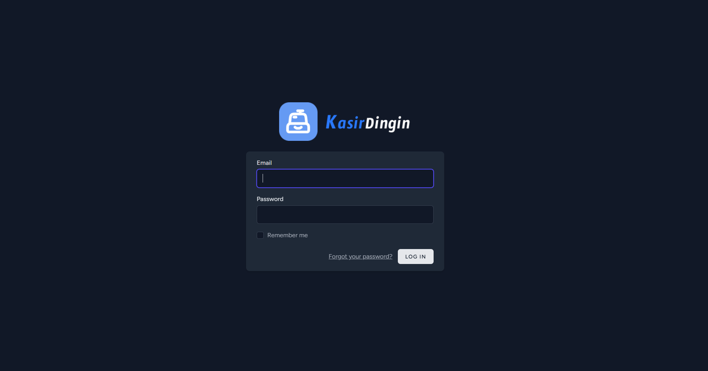
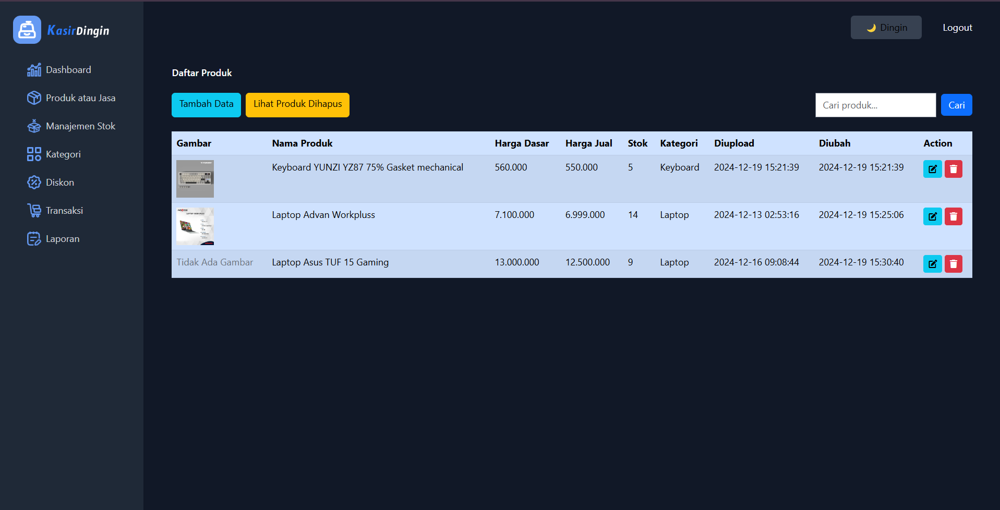

# Kasir Dingin

Kasir Dingin adalah aplikasi berbasis web yang dikembangkan menggunakan framework Laravel. Aplikasi ini dirancang untuk membantu pengelolaan sistem kasir dengan fitur-fitur yang mudah digunakan dan efisien.

## Fitur Utama

- [Mesin routing sederhana dan cepat](https://laravel.com/docs/routing).
- Kontainer injeksi dependensi yang kuat.
- Dukungan untuk berbagai back-end untuk [sesi](https://laravel.com/docs/session) dan [penyimpanan cache](https://laravel.com/docs/cache).
- ORM database yang intuitif dan ekspresif ([Eloquent](https://laravel.com/docs/eloquent)).
- Migrasi skema yang tidak bergantung pada jenis database ([Schema Migrations](https://laravel.com/docs/migrations)).
- Pemrosesan tugas latar belakang yang tangguh ([Job Queues](https://laravel.com/docs/queues)).
- Penyiaran peristiwa secara real-time ([Event Broadcasting](https://laravel.com/docs/broadcasting)).

Laravel memberikan aksesibilitas, kekuatan, dan alat yang diperlukan untuk membangun aplikasi yang besar dan kuat.

## Panduan Pembelajaran Laravel

Laravel memiliki dokumentasi yang sangat lengkap dan perpustakaan tutorial video yang luas untuk mempermudah memulai dengan framework ini. Beberapa sumber pembelajaran:

- [Dokumentasi Laravel](https://laravel.com/docs)
- [Laravel Bootcamp](https://bootcamp.laravel.com)
- [Laracasts](https://laracasts.com): Ribuan video tutorial tentang Laravel, PHP modern, pengujian unit, dan JavaScript.

## Sponsor Laravel

Terima kasih kepada sponsor berikut atas dukungan mereka terhadap pengembangan Laravel. Jika Anda tertarik menjadi sponsor, kunjungi [Laravel Partners Program](https://partners.laravel.com).

### Mitra Premium

- **[Vehikl](https://vehikl.com/)**
- **[Tighten Co.](https://tighten.co)**
- **[WebReinvent](https://webreinvent.com/)**
- **[Kirschbaum Development Group](https://kirschbaumdevelopment.com)**
- **[64 Robots](https://64robots.com)**
- **[Curotec](https://www.curotec.com/services/technologies/laravel/)**
- **[Cyber-Duck](https://cyber-duck.co.uk)**
- **[DevSquad](https://devsquad.com/hire-laravel-developers)**
- **[Jump24](https://jump24.co.uk)**
- **[Redberry](https://redberry.international/laravel/)**
- **[Active Logic](https://activelogic.com)**
- **[byte5](https://byte5.de)**
- **[OP.GG](https://op.gg)**

## Berkontribusi

Terima kasih telah mempertimbangkan untuk berkontribusi pada framework Laravel! Panduan kontribusi dapat ditemukan di [dokumentasi Laravel](https://laravel.com/docs/contributions).

## Kode Etik

Untuk memastikan komunitas Laravel tetap ramah dan inklusif, harap tinjau dan patuhi [Kode Etik](https://laravel.com/docs/contributions#code-of-conduct).

## Kerentanan Keamanan

Jika Anda menemukan kerentanan keamanan dalam Laravel, kirimkan email ke Taylor Otwell melalui [taylor@laravel.com](mailto:taylor@laravel.com). Semua kerentanan keamanan akan segera ditangani.

## Lisensi

Framework Laravel adalah perangkat lunak sumber terbuka yang dilisensikan di bawah [lisensi MIT](https://opensource.org/licenses/MIT).
